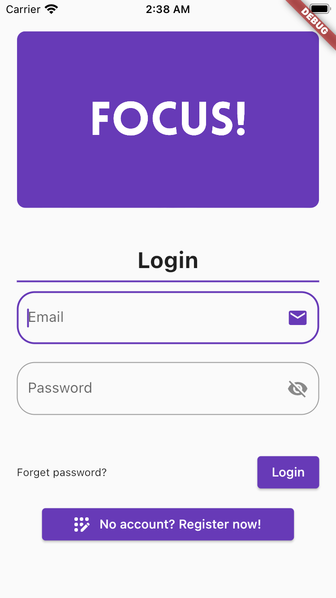
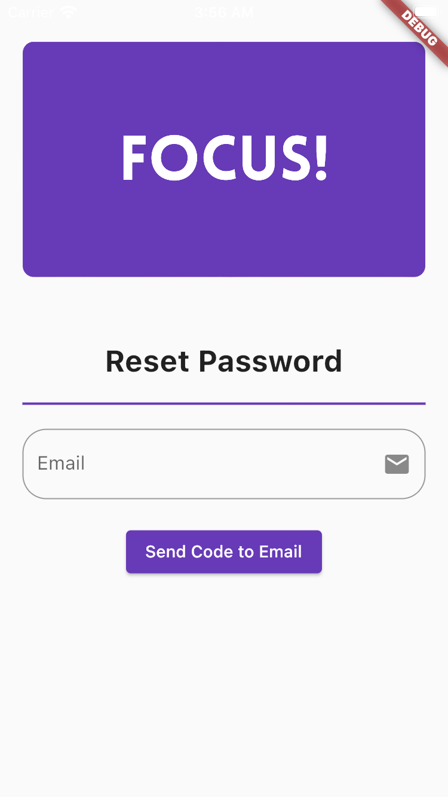

# FOCUS!

## Description
FOCUS! is an application to help you focus while performing a task.  The app is not intended for people with minor issues staying on task.  FOCUS! is for those of us who often end up off-task, browsing social media, etc. while we have things to do.

This is mostly a project to get familiar with Flutter, however it aims to solve a problem I personally experience.  I struggle with short term memory issues, and often find myself getting distracted & completely forgetting I have something I should be doing.

## Planned Features
- Authentication.  Login & Signup, and have your configs stored in the cloud for you to use on any device.  
- Push notification "spam." 

## Screenshots (Will be added as progress is made):
  
